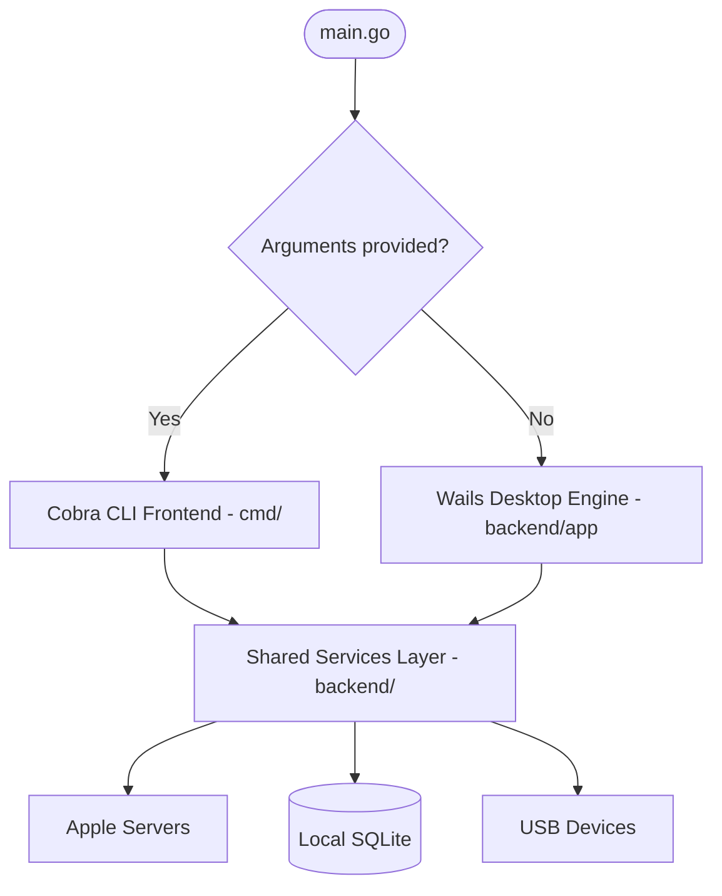

# System Architecture

**IPA Downloader** follows Clean Architecture and separation of concerns principles, completely decoupling core Apple protocols and business logic from the user-facing graphical interface (Wails) and the CLI engine (Cobra).

---

## Directory Structure

```text
ipa-downloader/
├── backend/
│   ├── app/         # Wails application lifecycle (Startup, DomReady, Shutdown, Dialogs)
│   ├── apple/       # Apple HTTP protocols (Storefront, Bag, Plist XML/Binary)
│   ├── auth/        # Apple ID authentication, 2FA, session tokens, and cookie jar
│   ├── config/      # User settings, download directories, and cache management
│   ├── device/      # usbmuxd protocol (gidevice), app install/uninstall, IPA validation
│   ├── download/    # Concurrent download manager and FairPlay SINF injection
│   ├── events/      # Real-time event dispatcher to frontend
│   ├── firmware/    # IPSW restore image querying service
│   ├── library/     # Local library, favorites, and download history
│   ├── models/      # Go data structures shared across Go and TypeScript
│   ├── search/      # Search service with multi-platform filters
│   ├── services/    # Unified AppService binding layer for Wails IPC
│   ├── storage/     # Thread-safe SQLite persistence layer
│   ├── update/      # Automatic update service with zip bundle handling
│   └── utils/       # OS file revealers, clipboard, and system utilities
├── frontend/
│   ├── src/
│   │   ├── pages/       # Pages: Search, Downloads, Devices, Library, Purchases, Firmware, Settings, Logs
│   │   ├── components/  # Modals (2FA, AppDetails), TitleBar, ToastContainer
│   │   ├── layouts/     # MainLayout with Glassmorphic sidebar
│   │   ├── stores/      # Pinia stores (auth, search, downloads, library, devices, settings, logs)
│   │   └── types/       # TypeScript interfaces synced with Go models
├── cmd/             # Cobra CLI commands implementation
└── main.go          # Dual-mode launcher (Desktop GUI / CLI)
```

---

## Dual Mode Launcher (`main.go`)

The entry point checks invocation arguments:
* When arguments are provided (`len(os.Args) > 1`), Cobra CLI is executed (`cmd.Execute()`).
* When launched without arguments (e.g. double-clicked from Finder or Start Menu), the Wails desktop window is created (`runDesktopApp()`).



---

## Zero-CGO SQLite Persistence

Local storage (library records, cached purchases, user preferences, and history) uses `modernc.org/sqlite`:
* **Zero-CGO**: Pure Go implementation without GCC requirements, ensuring smooth cross-compilation.
* **Automated Migrations**: Schema and indexes are checked and migrated on startup.
* **Thread Safety**: Mutex-controlled database access ensures concurrent reads and writes remain reliable.
