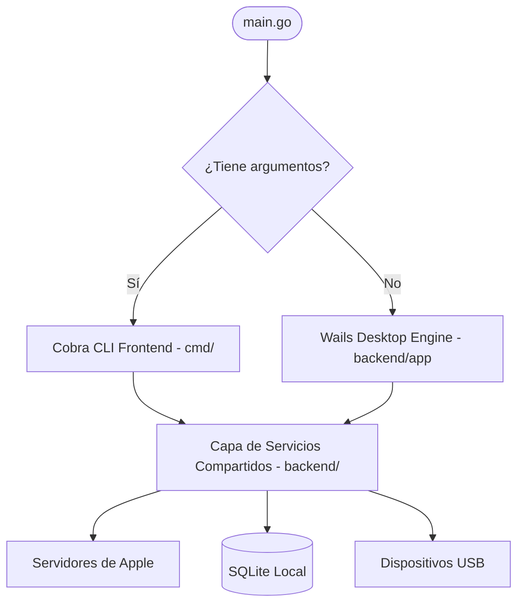

# Arquitectura del Sistema

**IPA Downloader** está diseñado siguiendo los principios de arquitectura limpia (*Clean Architecture*) y separación de responsabilidades, desacoplando la lógica de negocio y los protocolos de Apple tanto de la interfaz gráfica (Wails) como de la interfaz de consola (Cobra).

---

## Estructura de Directorios

```text
ipa-downloader/
├── backend/
│   ├── app/         # Ciclo de vida de la aplicación Wails (Startup, DomReady, Shutdown, Diálogos)
│   ├── apple/       # Protocolos HTTP de Apple (Storefront, Bag, Plist XML/Binary)
│   ├── auth/        # Autenticación Apple ID, 2FA, manejo de cookies y sesiones
│   ├── config/      # Preferencias de usuario, carpetas de descarga y caché
│   ├── device/      # Protocolo usbmuxd (gidevice), instalación/desinstalación y validación de IPA
│   ├── download/    # Gestor de descargas concurrentes y parches FairPlay SINF
│   ├── events/      # Despachador de eventos en tiempo real hacia el frontend
│   ├── firmware/    # Servicio de consulta de imágenes IPSW
│   ├── library/     # Biblioteca local, favoritos e historial
│   ├── models/      # Estructuras de datos Go compartidas con TypeScript
│   ├── search/      # Servicio de búsqueda con filtros de plataforma
│   ├── services/    # Capa unificada de enlace AppService para IPC con Wails
│   ├── storage/     # Capa de persistencia SQLite thread-safe
│   ├── update/      # Servicio de actualización automática
│   └── utils/       # Integraciones nativas de explorador, portapapeles y archivos
├── frontend/
│   ├── src/
│   │   ├── pages/       # Páginas: Buscar, Descargas, Dispositivos, Biblioteca, Compras, Firmwares, Ajustes, Logs
│   │   ├── components/  # Modales (2FA, AppDetails), Barra de título, Toasts
│   │   ├── layouts/     # Layout principal con barra lateral Glassmorphic
│   │   ├── stores/      # Stores Pinia (auth, search, downloads, library, devices, settings, logs)
│   │   └── types/       # Interfaces TypeScript sincronizadas con modelos de Go
├── cmd/             # Implementación de comandos CLI con Cobra
└── main.go          # Punto de entrada dual (Desktop GUI / CLI)
```

---

## Patrón de Lanzamiento Dual (`main.go`)

El archivo `main.go` inspecciona los argumentos de invocación:
* Si se proporcionan argumentos (`len(os.Args) > 1`), se inicializa el motor de comandos Cobra (`cmd.Execute()`).
* Si se ejecuta sin argumentos (por ejemplo, al hacer doble clic en el ejecutable o bundle `.app`), se inicializa la ventana nativa de Wails (`runDesktopApp()`).



---

## Persistencia con SQLite Zero-CGO

La persistencia local (biblioteca, compras cacheadas, ajustes y registros de historial) se realiza mediante `modernc.org/sqlite`:
* **Zero-CGO**: No requiere compilar con GCC ni Cgo habilitado, lo que garantiza binarios portables y compilación cruzada limpia.
* **Migraciones automáticas**: Las tablas e índices se migran automáticamente en el arranque de la aplicación.
* **Seguridad de concurrencia**: Conexiones controladas mediante mutex para lecturas y escrituras seguras en múltiples hilos.
