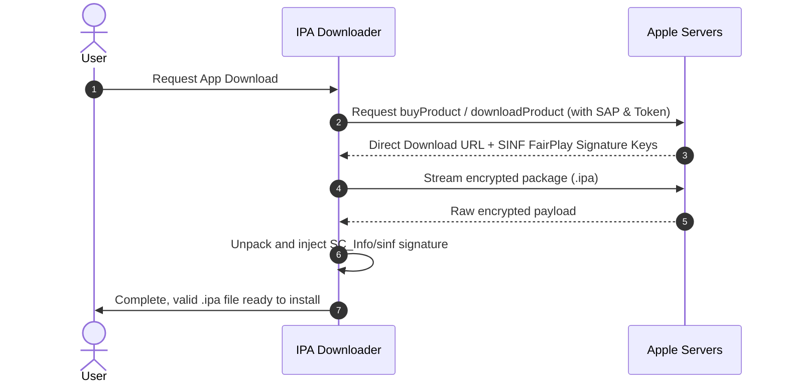

# App Store Protocol & FairPlay DRM

IPA Downloader implements the proprietary client protocols used by iTunes and Apple devices to negotiate licenses and transfer software.

---

## 1. Storefronts & Regional Catalogs

Apple divides the App Store into regional storefronts, each identified by a unique numeric code (e.g., `143441` for United States, `143454` for Spain, `143468` for Mexico):
* The HTTP header `X-Apple-Store-Front` is included in requests to ensure correct pricing, currency, and availability for the authenticated account's region.
* Search queries use iTunes public search APIs (`itunes.apple.com/search`).

---

## 2. GrandSlam Authentication & SAP Handshake

For account operations (licensing and downloading), Apple relies on GrandSlam:
* **GrandSlam Tokens**: After authenticating email, password, and 2FA with `gsa.apple.com`, Apple returns session credentials (`passwordToken` and `dsPrsID`).
* **SAP (Secure Apple Protocol)**: A cryptographic challenge-response mechanism validating client legitimacy. Before dispatching requests to endpoints like `buyProduct`, the client performs a SAP handshake to generate the `X-Apple-ActionSignature` header.

---

## 3. Download Flow & FairPlay DRM

1. **License Request**: An XML Plist payload is sent to `buyProduct`.
2. **License Response**: Apple returns:
   * Direct CDN download URL for the encrypted binary.
   * FairPlay signature blocks (`sinf`), containing decryption keys wrapped for the user's account identifier (`dsid`).
3. **SINF Injection**:
   * Official `.ipa` files downloaded without this step cannot be launched by iOS because they lack `SC_Info/<app_name>.sinf`.
   * IPA Downloader directly injects the `SC_Info` folder into the `.ipa` archive before finalizing the download.
