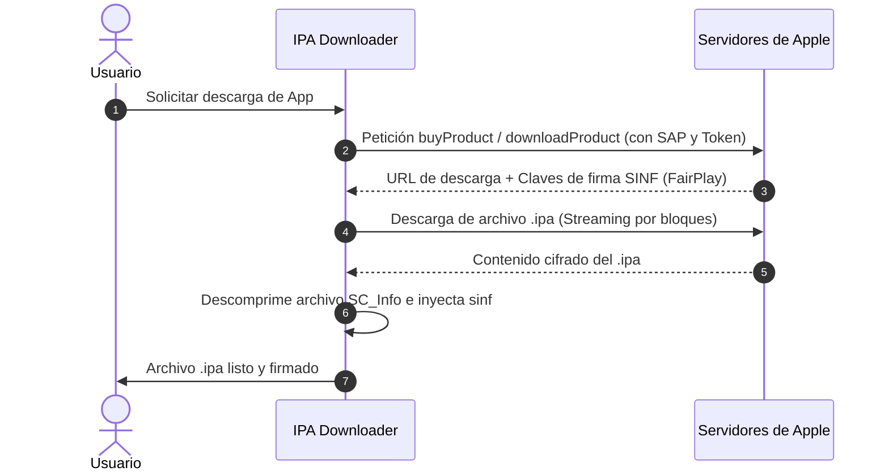

# Protocolo de la App Store y FairPlay

IPA Downloader implementa directamente los protocolos cliente que utiliza iTunes y los dispositivos Apple para negociar licencias y descargar software.

---

## 1. El Catálogo y las Tiendas (Storefronts)

Apple divide la App Store en múltiples *storefronts* geográficos. Cada storefront tiene un identificador numérico único (ej. `143441` para Estados Unidos, `143454` para España, `143468` para México):
* El encabezado HTTP `X-Apple-Store-Front` se envía en cada petición para recibir la moneda, disponibilidad y precios correctos del país de la cuenta.
* Los metadatos de búsqueda se obtienen a través de la API pública de iTunes (`itunes.apple.com/search`).

---

## 2. Autenticación GrandSlam y SAP

Para operaciones que involucran la cuenta del usuario (compras y descargas), Apple emplea el protocolo GrandSlam:
* **GrandSlam Token**: Tras autenticar correo, contraseña y 2FA en `gsa.apple.com`, el servidor entrega tokens de sesión autenticada (`passwordToken` y `dsPrsID`).
* **SAP (Secure Apple Protocol)**: Mecanismo de firma criptográfica para validar la autenticidad del cliente. Antes de enviar peticiones a endpoints protegidos como `buyProduct`, el cliente genera un handshake SAP para producir la cabecera de firma `X-Apple-ActionSignature`.

---

## 3. Descarga y DRM FairPlay

1. **Petición de Licencia**: Se envía una petición XML Plist al endpoint `buyProduct`.
2. **Respuesta de la Licencia**: Apple devuelve:
   * La URL directa al Content Delivery Network (CDN) donde está alojado el binario.
   * Los bloques de firma FairPlay (`sinf`), que contienen la clave de descifrado envuelta para el identificador único del usuario (`dsid`).
3. **Inyección SINF**:
   * Las aplicaciones descargadas sin este paso no pueden ser abiertas por iOS porque carecen del archivo `SC_Info/<nombre_app>.sinf`.
   * IPA Downloader inserta el bloque `sinf` directamente en la estructura ZIP del archivo `.ipa` antes de dar por completada la descarga.
