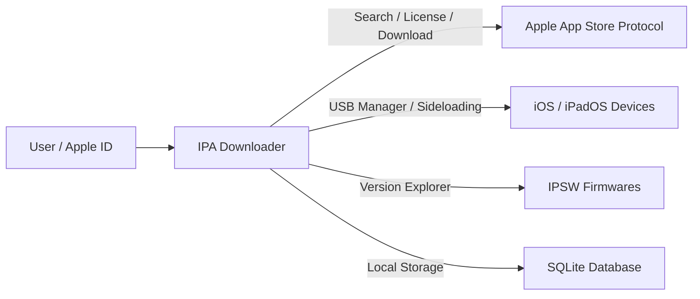

# IPA Downloader

  <strong>Modern desktop application and CLI suite for searching, downloading, and sideloading Apple App Store app packages (.ipa).</strong>

---

## What is IPA Downloader?

**IPA Downloader** (developed by **UDYAT**) is a comprehensive, native tool designed to interact directly with Apple's App Store infrastructure using your own Apple ID account.

It allows querying metadata, browsing version history, and downloading officially signed packages (`.ipa` for iOS/iPadOS/tvOS/visionOS and `.pkg` for macOS), complete with FairPlay DRM signature injection and integrated tools to manage and sideload apps onto USB-connected iPhones and iPads without requiring Xcode.

---

## Key Features

=== ":material-store: Direct App Store"
    * **Global Search** by app name or Bundle Identifier across multiple geographic storefronts.
    * **Multi-Platform Support**: iOS, iPadOS, tvOS, visionOS, and macOS.
    * **Version History**: Inspect previous builds and download historical versions using their external version identifiers.
    * **Your Purchases**: Instantly browse and download applications already acquired by your account.

=== ":material-cellphone-link: USB Device Manager"
    * **Automatic Detection** of USB-connected iPhones and iPads.
    * **Direct Sideloading**: Install `.ipa` packages onto connected devices in seconds without complex setup.
    * **Installed Apps Explorer**: List apps on your device and uninstall them with a single click.
    * **Package Validation**: Verify provisioning profiles, signatures, and device compatibility before installation.

=== ":material-lightning-bolt: High Performance & Queue"
    * **Concurrent Chunked Streaming** with live moving average speed, ETA, and pause/resume capability.
    * **FairPlay DRM SINF Replication**: Automatically replicates and injects FairPlay signatures into downloaded packages.
    * **Smart Recovery**: Automatic retry and license fallback handling for flaky Apple CDN endpoints.

=== ":material-shield-check: Privacy & Security"
    * **100% Local**: Credentials, sessions, and tokens stay securely on your machine.
    * **OS Keychain Integration**: Encrypted storage via macOS Keychain, Windows Credential Manager, or Linux Secret Service.
    * **Seamless 2FA**: In-app modal prompt for two-factor authentication codes.

=== ":material-laptop: Dual Interface (Desktop + CLI)"
    * **Desktop GUI**: Built with Wails v2, Vue 3, and TailwindCSS, featuring a clean dark and light mode.
    * **Command-Line Interface (CLI)**: The exact same binary provides a scriptable CLI for automation, CI/CD, and headless environments.

---

## Quick Navigation

Check the guides to get started:

- [Installation Guide](getting-started/installation.md)
- [Quickstart Guide](getting-started/quickstart.md)
- [CLI Reference](cli/commands.md)
- [System Architecture](architecture/architecture.md)
