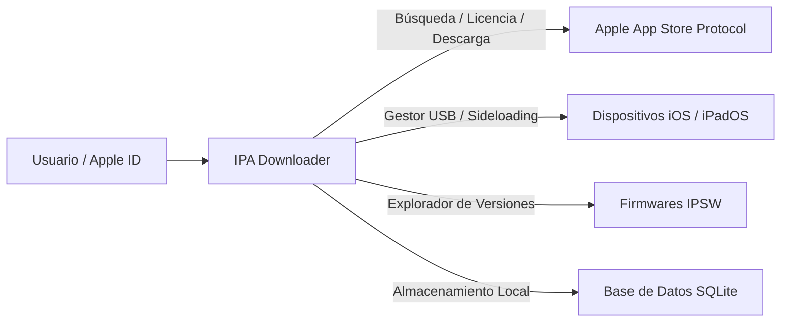

# IPA Downloader

  <strong>Aplicación de escritorio moderna y suite CLI para buscar, descargar y realizar sideloading de paquetes de aplicaciones de la App Store de Apple.</strong>

---

## ¿Qué es IPA Downloader?

**IPA Downloader** (desarrollado por **UDYAT**) es una solución completa y nativa para interactuar directamente con la infraestructura de la App Store de Apple utilizando tu propia cuenta de Apple ID.

Permite consultar metadatos, versiones históricas y descargar paquetes oficiales firmados (`.ipa` para iOS/iPadOS/tvOS/visionOS y `.pkg` para macOS), con inyección de firma FairPlay DRM y herramientas integradas para gestionar e instalar apps por USB en iPhones y iPads sin necesidad de Xcode.

---

## Características Principales

=== ":material-store: App Store Directo"
    * **Búsqueda global** por nombre o Bundle Identifier a través de múltiples storefronts.
    * **Soporte multiplataforma**: iOS, iPadOS, tvOS, visionOS y macOS.
    * **Historial de versiones**: Consulta versiones anteriores y descarga builds específicas con su identificador externo.
    * **Tus Compras**: Visualiza y descarga al instante aplicaciones ya adquiridas en tu cuenta.

=== ":material-cellphone-link: Gestor de Dispositivos USB"
    * **Detección automática** de dispositivos iPhone y iPad conectados por USB.
    * **Sideloading directo**: Instala paquetes `.ipa` en tus dispositivos en segundos sin configuraciones complejas.
    * **Explorador de apps**: Lista las aplicaciones instaladas en tu dispositivo y desinstala con un clic.
    * **Validación de paquetes**: Revisa perfiles de aprovisionamiento, firmas y compatibilidad antes de instalar.

=== ":material-lightning-bolt: Rendimiento y Descargas"
    * **Descargas concurrentes** con control de velocidad, tiempo estimado (ETA) y pausa/reanudación.
    * **Inyección FairPlay SINF**: Firma y parcha los paquetes para garantizar su funcionamiento legítimo.
    * **Cola inteligente** con recuperación y reintentos automáticos ante cortes de conexión.

=== ":material-shield-check: Privacidad y Seguridad"
    * **Todo es local**: Tus credenciales y tokens de sesión nunca salen de tu máquina.
    * **Integración con Keychain**: Compatible con el llavero nativo del sistema operativo (Keychain en macOS, Credential Manager en Windows, Secret Service en Linux).
    * **Soporte 2FA nativo**: Manejo fluido de códigos de autenticación de doble factor.

=== ":material-laptop: Interfaz Dual (Desktop + CLI)"
    * **Desktop GUI**: Creada con Wails v2, Vue 3 y TailwindCSS con soporte para modo claro y oscuro.
    * **Línea de Comandos (CLI)**: El mismo binario funciona como herramienta CLI scriptable mediante subcomandos para automatización y servidores.

---

## Comenzar Rápido

Consulta las guías de instalación según tu sistema operativo:

- [Guía de Instalación](getting-started/installation.md)
- [Inicio Rápido y Primeros Pasos](getting-started/quickstart.md)
- [Referencia del Modo CLI](cli/commands.md)
- [Arquitectura del Sistema](architecture/architecture.md)
